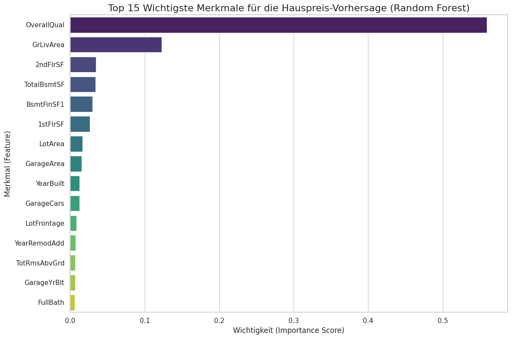

# Hauspreis-Vorhersage (Regressions-Analyse)

Dieses Repository dokumentiert ein End-to-End Machine-Learning-Projekt zur Vorhersage von Hauspreisen in Ames, Iowa, basierend auf dem bekannten Kaggle-Datensatz "House Prices: Advanced Regression Techniques".

Das Projekt umfasst eine detaillierte Datenbereinigung, umfassendes Feature Engineering und das Training eines Basismodells (Lineare Regression), das eine **Genauigkeit (R² Score) von 0.64** auf dem Testdatensatz erreichte.

---

## Inhaltsverzeichnis
1.  [Projekt-Workflow](#projekt-workflow)
2.  [Ergebnisse des Basismodells](#ergebnisse-des-basismodells)
3.  [Verwendete Technologien](#verwendete-technologien)
4.  [Setup und Ausführung](#setup-und-ausführung)
5.  [Nächste Schritte](#nächste-schritte)
6.  [Autor](#autor)
7.  [Lizenz](#lizenz)

---

## Projekt-Workflow

Das Projekt folgt einem strukturierten Workflow, der die folgenden Phasen umfasst:

**1. Explorative Datenanalyse (EDA)**
* Analyse des Datensatzes mit fast 80 Merkmalen zur Identifizierung von Datentypen, Verteilungen und potenziellen Korrelationen.
* Besondere Untersuchung der Zielvariable `SalePrice`, um deren Verteilung (leichte Rechtsschiefe) zu verstehen.

**2. Datenbereinigung (Data Cleaning)**
Eine mehrstufige Strategie wurde angewendet, um fehlende Werte (`NaN`) zu behandeln:
* **Entfernen von Spalten:** Spalten mit einem sehr hohen Anteil an fehlenden Werten (>80% wie `PoolQC`, `MiscFeature`, `Alley`, `Fence`) wurden entfernt.
* **Bedeutungsvolle Imputation:** Für kategoriale Merkmale, bei denen `NaN` eine spezifische Bedeutung hat (z.B. "Kein Kamin" bei `FireplaceQu`), wurden die fehlenden Werte mit `"None"` aufgefüllt.
* **Numerische Imputation:** Fehlende numerische Werte wurden kontextabhängig mit `0` gefüllt (z.B. `GarageYrBlt` oder `MasVnrArea` bei Abwesenheit des Merkmals).
* **Intelligente Imputation:** Fehlende `LotFrontage`-Werte wurden mit dem **Median der jeweiligen Nachbarschaft** aufgefüllt, was genauer ist als ein globaler Median.

**3. Feature Engineering**
* **One-Hot Encoding:** Alle verbleibenden kategorialen Text-Spalten (z.B. `MSZoning`, `LotShape` etc.) wurden in numerische Merkmale umgewandelt. Dies erweiterte den Datensatz auf über 200 Spalten.
* Der Datensatz wurde so in ein vollständig numerisches Format überführt, das für Machine-Learning-Modelle geeignet ist.

**4. Modelltraining & Evaluierung**
* Die aufbereiteten Daten wurden in ein Trainings- (80%) und ein Testset (20%) aufgeteilt.
* Ein **Lineares Regressionsmodell** wurde als Basismodell ("Baseline") trainiert, um eine erste Leistungsmessung zu erhalten.

---

## Ergebnisse des Basismodells

## Modellvergleich und Ergebnisse

Um die Leistung zu bewerten, wurde zunächst ein einfaches **Lineares Regressionsmodell** als Basislinie (Baseline) trainiert. Anschließend wurde ein **RandomForest-Regressionsmodell** trainiert, um die Vorhersagegenauigkeit zu verbessern.

### Leistungsvergleich der Modelle

Die folgende Tabelle zeigt einen direkten Vergleich der Leistung beider Modelle auf dem Testdatensatz:

| Metrik                      | Lineare Regression | Random Forest              |
| --------------------------- | ------------------ | -------------------------- |
| **R² Score** (Bestimmtheitsmaß) | `0.6415`           | `0.8916` (deutliche Verbesserung ✅) |
| **RMSE** (Fehler in USD)    | `$52,438.57`       | `$28,832.35` (Fehler fast halbiert ✅) |

Wie die Tabelle zeigt, übertrifft das RandomForest-Modell das lineare Regressionsmodell in allen relevanten Metriken deutlich. Der R²-Wert steigt um ca. 25 Prozentpunkte und der durchschnittliche Vorhersagefehler (RMSE) wird fast halbiert.

### Visuelle Darstellung (Random Forest)

Der folgende Scatter-Plot vergleicht die tatsächlichen Verkaufspreise mit den vom (deutlich verbesserten) RandomForest-Modell vorhergesagten Preisen. Man erkennt, dass die Punkte nun deutlich enger um die rote diagonale "Perfekte Vorhersage"-Linie liegen als beim ersten Modell.


*(Stelle sicher, dass der Dateiname mit deiner hochgeladenen Bilddatei übereinstimmt. Z.B. (`echte vs. vorhergesagte preise (Random Forest Regressor).png`)*

---

## Analyse der Merkmalswichtigkeit (Feature Importance)

Ein großer Vorteil des RandomForest-Modells ist die Möglichkeit, die Wichtigkeit der einzelnen Merkmale zu analysieren. Das Modell teilt uns mit, welche Datenpunkte am meisten zu seinen Preisvorhersagen beigetragen haben.


*(Stelle sicher, dass der Dateiname mit deiner hochgeladenen Bilddatei übereinstimmt. Z.B. `feature_importance.png`)*

**Erkenntnisse:**
Die Analyse zeigt, dass Merkmale wie `OverallQual` (Gesamtqualität), `GrLivArea` (Wohnfläche) und `YearBuilt` (Baujahr) erwartungsgemäß den größten Einfluss auf die Preisvorhersage haben. Dies bestätigt die Intuition und liefert wertvolle Einblicke in die Treiber der Hauspreise im Datensatz.

---

## Verwendete Technologien
* **Sprache:** Python 3.x
* **Bibliotheken:**
    * `Pandas` & `NumPy`: Für Datenmanipulation und numerische Berechnungen.
    * `Scikit-learn`: Für Modelltraining (`LinearRegression`), Datenaufteilung und Evaluierungsmetriken.
    * `Matplotlib` & `Seaborn`: Für die Datenvisualisierung.
* **Umgebung:** Jupyter Notebook / Google Colaboratory.

---

## Setup und Ausführung

Um die Analyse und das Modelltraining nachzuvollziehen:

1.  **Klone dieses Repository:**
    ```bash
    git clone [https://github.com/](https://github.com/)obiri288/repositories.git
    cd repositories
    ```

2.  **Installiere die Abhängigkeiten:**
    ```bash
    pip install pandas numpy scikit-learn matplotlib seaborn
    ```

3.  **Führe das Notebook aus:**
    Öffne die `.ipynb`-Datei in einer Jupyter-Umgebung und führe die Zellen aus. Die Daten (`train.csv`) müssen sich im selben Verzeichnis befinden oder der Pfad muss angepasst werden.

---

## Nächste Schritte

Das lineare Regressionsmodell dient als solide Baseline. Geplante nächste Schritte zur Verbesserung der Vorhersagegenauigkeit umfassen:
* Training von komplexeren, nicht-linearen Modellen wie `RandomForestRegressor` und `GradientBoostingRegressor`.
* Anwendung von Merkmalskalierung (`StandardScaler`).
* Detailliertere Analyse der Merkmalswichtigkeit (Feature Importance).

---

## Autor

* **Obiri Bordom**
* GitHub: `https://github.com/obiri288`

---

## Lizenz

Dieses Projekt ist unter der **MIT Lizenz** lizenziert.
